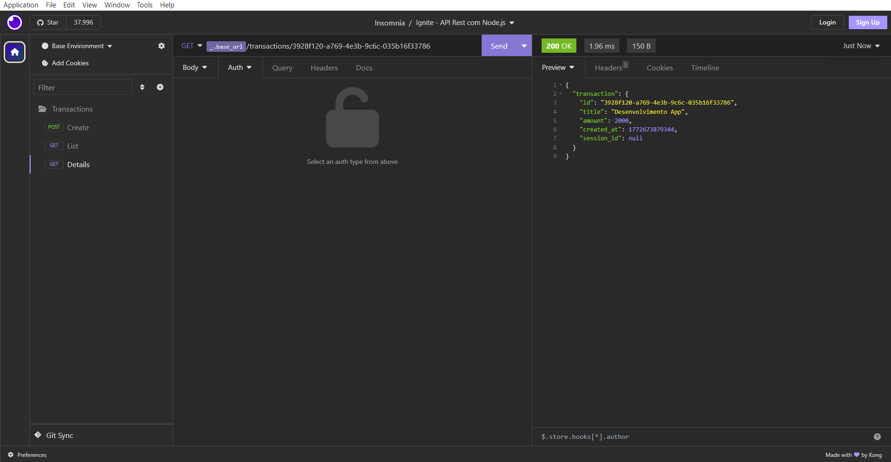

<h1 align="center">
  
</h1>

<h3 align="center">
  FinApi - Financeia
</h3>

<p align="center">Criação de uma simples API para controle financeiro utilizando o Node.js</p>

<p align="center">
  <a href="#como-executar-o-projeto">Como executar o projeto</a>&nbsp;&nbsp;&nbsp;|&nbsp;&nbsp;&nbsp;
  <a href="#sobre">Sobre</a>&nbsp;&nbsp;&nbsp;|&nbsp;&nbsp;&nbsp;
  <a href="#anotações">Anotações</a>
</p>

<p align="center">Back-end</p>

<p align="center">
  
</p>

## Como executar o projeto

### Clonar este repositório

```bash
git clone https://github.com/eliasmcastro/rocketseat-ignite-nodejs-api-rest.git
```

### Requisitos

- [Node.js](https://nodejs.org) na versão 22.21.1
- [Yarn](https://yarnpkg.com) na versão 1.22.5

#### Opcional

- [Insomnia](https://insomnia.rest)

### Passos para a execução

**1. Executar aplicação**

Instalar as dependências do projeto

```bash
yarn
```

Iniciar o servidor de desenvolvimento

```bash
yarn dev
```

A aplicação começará a ser executada em http://localhost:3333

_Dica: utilizar o Insomnia para testar as rotas_

- Abrir o Insomnia -> Application -> Preferences -> Data -> Import Data -> From File -> Selecionar o arquivo insomnia.json

## Sobre

### RF

- O usuário deve poder criar uma nova transação
- O usuário deve poder obter um resumo da sua conta
- O usuário deve poder listar todas transações que já ocorreram
- O usuário deve poder visualizar uma transação única

### RN

- A transação pode ser do tipo crédito que somará ao valor total, ou débito subtrairá
- Deve ser possível identificarmos o usuário entre as requisições
- O usuário só pode visualizar transações o qual ele criou

## Anotações

### Configurando estrutura

- `yarn init -y` inicializa o projeto e cria o arquivo package.json
- `yarn add typescript -D` instala o TypeScript
- `yarn tsc --init` cria o arquivo tsconfig.json, onde ficam as configurações do compilador TypeScript
- `yarn add fastify` instala o Fastify (framework para criar servidores HTTP)
- `yarn add @types/node -D` instala as definições de tipos do Node.js
- `yarn add tsx -D` instala o tsx, para executar arquivos TypeScript sem precisar compilar manualmente antes
- Em `package.json` configurar o comando para executar a aplicação:

  ```json
  "scripts": {
    "dev": "tsx watch src/server.ts"
  }
  ```

### Padrões de Projeto com ESLint e Prettier

O ESLint serve para padronizar o projeto

- `yarn add eslint @rocketseat/eslint-config -D` instala as dependências necessárias
- Criar o arquivo `.eslintrc.json` e adicionar

  ```json
  {
    "extends": [
      "@rocketseat/eslint-config/node"
    ]
  }
  ```

- Em `package.json` configurar o comando para executar o lint:

  ```json
  "scripts": {
    "lint": "eslint src --ext .ts --fix"
  }
  ```

- Instalar a extensão `ESlint` no VSCode
- Abrir o arquivo de configuração do VSCode:
  - `CTRL + SHIFT + P`
  - Pesquisar por `Open User Settings (JSON)`
  - Adicionar `"editor.codeActionsOnSave": { "source.fixAll.eslint": "explicit" }`

### Banco de Dados

- `yarn add knex sqlite3` instala o Knex.js e driver do banco de dados do sqlite
- Em `package.json` configurar o comando para executar o knex:

  ```json
  "scripts": {
    "knex": "tsx ./node_modules/knex/bin/cli.js"
  }

- `yarn knex migrate:make create-documents` cria uma migration
- `yarn knex migrate:latest` executa todas as migrations
- `yarn knex migrate:rollback` desfaz a última execução das migrations

### Variáveis de ambiente

- Criação do .env
- `yarn add dotenv` instala o dotenv

### Validação de dados

- `yarn add zod` instala o zod

### Utilizando cookies no Fastify

- `yarn add @fastify/cookie` instala o @fastify/cookie

### Testes automatizados

- Testes unitários são testes que validam o comportamento de uma única unidade de código, como uma função ou método. Eles são úteis para garantir que cada parte da aplicação esteja funcionando corretamente, sem depender de outras partes.

- Testes de integração são testes que validam a integração entre várias partes da aplicação, como a integração entre a camada de banco de dados e a camada de serviço. Eles são importantes para garantir que a aplicação esteja funcionando corretamente como um todo.

- Testes e2e (end-to-end) são testes que validam o comportamento da aplicação como um todo, simulando a interação do usuário com a aplicação. Eles são importantes para garantir que a aplicação esteja funcionando corretamente em todos os níveis, desde a camada de interface até a camada de banco de dados.

- A pirâmide de testes é uma estratégia que se baseia em ter mais testes unitários e menos testes de integração e e2e, pois testes unitários são mais rápidos e fáceis de escrever e manter do que outros tipos de testes.

- `yarn add vitest -D` instal o vitest

- Em `package.json` configurar o comando para executar os testes:

  ```json
  "scripts": {
    "test": "vitest"
  }
